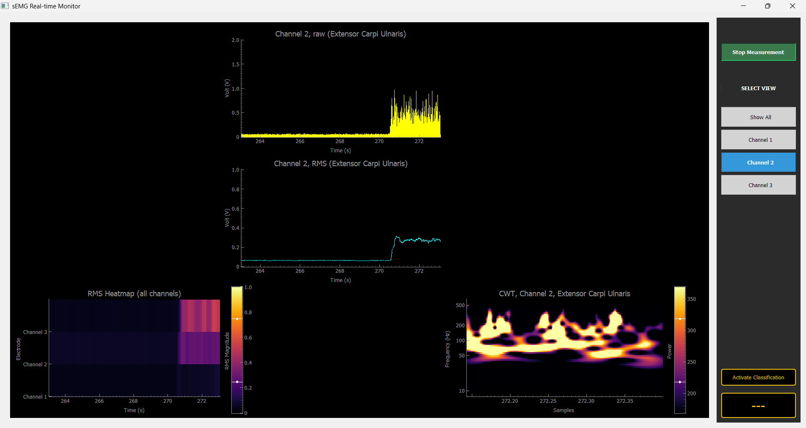

# Wireless sEMG band

This GitHub repository provides the code used to connect to, plot, and identify movements for the armband developed during a bachelor's thesis. It includes the ESP32 code used for wireless transmission and sampling on the ESP32-S3-DevKitC, as well as 64-bit x86-targeted code for signal processing, plotting, and movement classification.

# Usage

